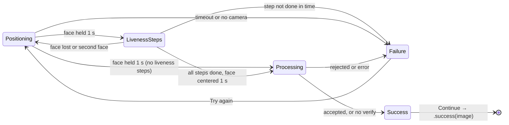

# FaceVerificationSDK

FaceVerificationSDK adds a ready-made "Face recognition" screen to your iOS app: it guides the user to position their face, captures a clear photo, optionally checks it with your own logic, and returns the result through a callback.

The screen moves through four states:

| State | What the user sees |
| --- | --- |
| Positioning | Live camera in a circle, "Position your face to fit the frame", plus a live hint such as "Move closer" |
| Liveness steps (optional) | One prompt at a time, such as "Turn your head left", with an arrow on the circle and "Step 2 of 5" |
| Processing | The captured photo inside a spinning green dashed ring |
| Success | The photo with a green ring, a check badge and a **Continue** button |
| Failure | A dark circle with a red ring, a warning badge and a **Try again** button |

Requirements:

- iOS 15 or later, iPhone, portrait
- Xcode 15 or later (Swift 5.9 tools)
- No third-party dependencies: only Apple's Vision, AVFoundation and SwiftUI
- No networking: the SDK never sends the photo anywhere; your app decides what to do with it

## Installation

Add the SDK as a Swift package, then add the camera permission text to your app.

1. In Xcode, choose **File > Add Package Dependencies**.
2. Enter the SDK's repository URL, or click **Add Local** and pick the `ios-face-verification-sdk` folder.
3. Add the **FaceVerificationSDK** library to your app target.
4. In your app's Info.plist, add `NSCameraUsageDescription` with a sentence explaining why you need the camera.

To add it through `Package.swift` instead:

```swift
dependencies: [
    .package(path: "../ios-face-verification-sdk")   // or .package(url: "<repo URL>", branch: "main")
],
targets: [
    .target(name: "MyApp", dependencies: ["FaceVerificationSDK"])
]
```

Info.plist entry:

```xml
<key>NSCameraUsageDescription</key>
<string>The camera is used to scan your face for verification.</string>
```

Without this entry, iOS closes the app the first time the SDK asks for the camera.

## Quick start

One call opens the screen full screen; the completion runs once, after the screen closes.

**UIKit**

```swift
import FaceVerificationSDK

FaceVerification.present(from: self) { result in
    switch result {
    case .success(let image): // use the captured face photo
    case .failure(let error): // see Results and errors
    case .cancelled:          // user tapped Back
    }
}
```

**SwiftUI**

```swift
import FaceVerificationSDK

struct ProfileView: View {
    @State private var showScan = false

    var body: some View {
        Button("Verify face") { showScan = true }
            .faceVerification(isPresented: $showScan) { result in
                // handle result
            }
    }
}
```

**With your own check and options**

Pass `verify` to decide success yourself, for example by calling your backend or comparing with a stored photo. Return `true` to accept, `false` to reject, or throw on error.

```swift
var config = FaceVerificationConfig()
config.challenges = [.turnLeft, .turnRight, .lookUp, .lookDown, .blink]

FaceVerification.present(
    from: self,
    config: config,
    verify: { image in
        try await myService.verify(image)   // returns Bool
    },
    completion: { result in /* ... */ }
)
```

To embed the screen in your own navigation instead of presenting it, use `FaceVerificationView(config:verify:onFinish:)` directly.

## How the flow works

The SDK captures a photo only after one face has stayed correctly placed for 1 second and has passed any liveness steps, and any failure lets the user try again.



The user can only leave with a result through **Continue** or **Back**. Back closes the screen at any point with `.cancelled`, or with `.failure(error)` from the failure screen.

While positioning, each camera frame is checked in this order. The first check that fails sets the hint under the title:

1. Exactly one face is visible: "No face detected" or "Make sure only one face is visible"
2. The face is 35–85% of the circle's width: "Move closer" or "Move back a little"
3. The face is near the circle's center: "Center your face in the circle"
4. The head is tilted or turned less than about 20°: "Look straight at the camera"

When every check passes, the ring turns green and the hint says "Hold still". If a check fails during the hold, the timer restarts. After `stabilityDuration` (1 s), the SDK moves on to the liveness steps, or straight to Processing if there are none.

### Liveness steps

Liveness steps prove a real person is in front of the camera. They run one after another, in the order you list them in `challenges`:

| Step | Prompt | Passes when |
| --- | --- | --- |
| `.turnLeft` | Turn your head left | Head turns about 20° to the user's left |
| `.turnRight` | Turn your head right | Head turns about 20° to the user's right |
| `.lookUp` | Look up | Head tilts about 15° up |
| `.lookDown` | Look down | Head tilts about 15° down |
| `.blink` | Blink your eyes | Eyes close and reopen |

- An arrow on the circle points the way to turn, and the ring fills as steps are completed.
- After each step, the head must come back near center before the next step counts, so one diagonal pose can't pass two steps.
- If the face leaves the frame or a second face appears, the scan starts over from Positioning, so a different person can't finish someone else's steps.
- Each step has `challengeTimeout` (8 s). Missing it shows the failure screen with `.livenessFailed`.

After the last step, the user looks straight at the camera again and holds still for 1 s. The photo is captured from these centered frames, so it is never a turned face. The SDK keeps the sharpest frame with eyes open.

In Processing, the SDK calls your `verify` closure with the photo. Without one, it goes straight to Success. Processing shows for at least `minimumProcessingDuration` (0.8 s).

## Configuration reference

Everything is set on `FaceVerificationConfig`; every value has a default, so change only what you need.

**Behavior**

| Property | Default | What it does |
| --- | --- | --- |
| `challenges` | `[]` (none) | Liveness steps to run, in this order. See [Liveness steps](#liveness-steps) |
| `challengeTimeout` | `8` s | Time allowed for each liveness step before failing with `.livenessFailed` |
| `requireBlink` | `false` | Shorthand for adding `.blink` to `challenges` |
| `showsDebugInfo` | `false` | Shows head angles and eye openness on screen, for tuning on a device |
| `timeout` | `30` s | Time allowed to position the face before failing with `.timeout` |
| `stabilityDuration` | `1.0` s | How long the face must stay correctly placed before capture |
| `minimumProcessingDuration` | `0.8` s | Shortest time "Processing" is shown, so it doesn't just flash |
| `cameraPosition` | `.front` | Camera to use |

**Text** (`config.strings`)

| Property | Default |
| --- | --- |
| `navigationTitle` | Face recognition |
| `positionFace` | Position your face to fit the frame |
| `processing` | Processing |
| `success` | Your face scan is complete |
| `failure` | Could not complete face recognition |
| `cameraPermissionDenied` | Camera access is needed to scan your face |
| `continueButton` / `tryAgainButton` / `openSettingsButton` | Continue / Try again / Open Settings |
| `hintNoFace` | No face detected |
| `hintMultipleFaces` | Make sure only one face is visible |
| `hintMoveCloser` / `hintMoveBack` | Move closer / Move back a little |
| `hintCenterFace` | Center your face in the circle |
| `hintLookStraight` | Look straight at the camera |
| `hintReady` | Hold still |
| `challengeTurnLeft` / `challengeTurnRight` | Turn your head left / Turn your head right |
| `challengeLookUp` / `challengeLookDown` | Look up / Look down |
| `challengeBlink` | Blink your eyes |
| `challengeStepFormat` | Step %d of %d |

Line breaks (`\n`) in the titles are kept, so you control how they wrap.

**Look** (`config.theme`)

| Property | Default | Used for |
| --- | --- | --- |
| `background` | `#EFF1F6` | Screen background |
| `card` | white | Center card and bottom bar |
| `textPrimary` / `textSecondary` | `#1B1B2F` / `#6B6B80` | Titles / hints |
| `idleRing` | `#DCDAF0` | Ring while positioning |
| `success` | `#5DBB6E` | Ready ring, processing ring, success ring and badge |
| `failure` / `failureBadgeBackground` | `#E0665A` / `#F8D7D7` | Failure ring, warning icon and its circle |
| `buttonBackground` / `buttonText` | `#1E1B2E` / white | Bottom button |
| `fontName` | `nil` (system font) | Custom font, e.g. `"Manrope-SemiBold"`; register the font in your app first |

Example:

```swift
var config = FaceVerificationConfig()
config.timeout = 45
config.strings.navigationTitle = "Verify identity"
config.theme.buttonBackground = Color(red: 0.16, green: 0.36, blue: 0.95)
```

## Results and errors

The completion receives exactly one `FaceVerificationResult`, after the screen has closed.

| Result | When |
| --- | --- |
| `.success(UIImage)` | User tapped **Continue** on the success screen. The image is the sharpest frame captured (portrait, 720 × 1280 on most iPhones, mirrored like a selfie). |
| `.failure(FaceVerificationError)` | User tapped **Back** while a failure was on screen |
| `.cancelled` | User tapped **Back** before a result was shown |

On the failure screen the user can tap **Try again** as many times as they like; you only hear about the failure if they leave with **Back**.

| Error | Cause | What to do |
| --- | --- | --- |
| `.cameraPermissionDenied` | User refused camera access. The screen shows **Open Settings**. | Ask the user to allow the camera in Settings |
| `.cameraUnavailable` | No usable camera (e.g. the simulator) | Run on a real device |
| `.timeout` | No well-placed face within `timeout` seconds | Let the user retry; consider a longer timeout |
| `.livenessFailed` | A liveness step wasn't done within `challengeTimeout` | Let the user retry; consider a longer step time |
| `.rejected` | Your `verify` closure returned `false` | Treat as a failed match |
| `.verificationFailed(Error)` | Your `verify` closure threw | Inspect the wrapped error, e.g. a network failure |

```swift
case .failure(.verificationFailed(let underlying)):
    print("Verify failed:", underlying.localizedDescription)
```

## Demo app

The repo includes a demo app in `Example/` for trying every outcome on a real iPhone.

1. Open `Example/FaceVerificationDemo.xcodeproj`.
2. Select the **FaceVerificationDemo** target, open **Signing & Capabilities**, and choose your team. Change the bundle ID from `com.example.FaceVerificationDemo` if Xcode asks.
3. Connect your iPhone, select it as the run destination, and press **Run**.
4. On first launch, allow camera access.

| Demo option | What it tests |
| --- | --- |
| Liveness steps: Turn left / Turn right / Look up / Look down / Blink | Which steps run (all on by default), in the order shown |
| Time per step (3–20 s) | The `.livenessFailed` failure |
| Show debug info (head angles) | Live yaw, pitch, roll and eye values under the circle |
| Verification: Capture only | Success as soon as a good photo is captured |
| Verification: Verify → accept / reject / throw error | Success, `.rejected` and `.verificationFailed` |
| Verify delay (0–5 s) | How long the Processing ring shows |
| Timeout (5–60 s) | The `.timeout` failure |
| Custom theme & strings | Changed title, button text and colors |

**Last result** shows what the completion received, and the captured photo on success.

The project is generated from `Example/project.yml` with XcodeGen. After editing that file, run `xcodegen generate` in `Example/`.

## Troubleshooting and FAQ

| Problem or question | Answer |
| --- | --- |
| App crashes when the screen opens | `NSCameraUsageDescription` is missing from Info.plist |
| Failure screen appears straight away in the simulator | The simulator has no camera (`.cameraUnavailable`); test on a real iPhone |
| Screen shows **Open Settings** | Camera access was denied; the button opens your app's Settings page |
| Hint stays on "Move closer" or "Center your face" | The face must fill roughly 35–85% of the circle's width and sit near its center |
| Hint stays on "Look straight at the camera" | Head is tilted or turned more than about 20° |
| Blink is not detected | Blink fully and reopen your eyes; good, even lighting helps |
| A turn or tilt step never passes | Turn further, then check `showsDebugInfo`: the angle must pass about 20° (turn) or 15° (tilt) |
| Left and right (or up and down) are swapped | Flip the sign in `ChallengeTracker.userLeftYawSign` or `lookUpPitchSign` |
| Does the SDK upload the photo? | No. The photo only goes to your `verify` closure and completion |
| Does it stop printed photos or screens? | Liveness steps block a printed photo, which can't turn or blink. A video that plays the same moves in the same order could still pass. For stronger anti-spoofing, add a server-side liveness check in `verify` |
| Can I use it in landscape or on iPad? | Not yet; the screen is designed for iPhone in portrait |
